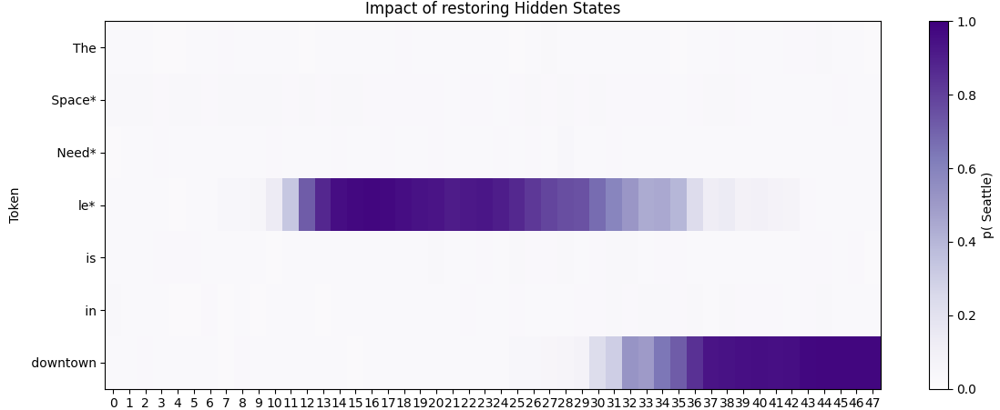
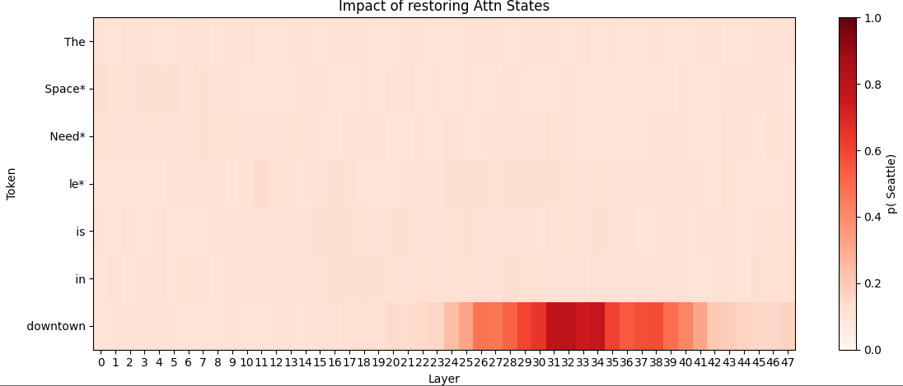

# mini_ROME
My humble attempt at recreating the ROME ( rank one model editing ) model by Kevin Meng and David Bau 


## GPT-2 Activation Tracing & AIE Effects

This project analyzes how **activations inside GPT-2** change when noise is added or removed at specific layers/tokens.  
It lets you visualize the effects on **Residual**, **MLP**, and **Attention** activations to understand their impact on model predictions.

## 📊 Example Outputs

- **Residual States Heatmap** → Impact of restoring residual activations

- **MLP States Heatmap** → Impact of restoring MLP activations 
 
- **Attention States Heatmap** → Impact of restoring attention activations

Each heatmap shows how restoring activations at certain layers/tokens changes model prediction probabilities.

---

## 🚀 Features

- Load GPT-2 model using [TransformerLens](https://github.com/TransformerLensOrg/TransformerLens)
- Add Gaussian noise to activations at selected layers/tokens
- Restore activations to measure their contribution to predictions
- Visualize **Residual**, **MLP**, and **Attention** activation effects with heatmaps
- Compute **Average Indirect Effects (AIE)** across layers and tokens

---

## 📂 Project Structure

```
ml_project/
│
├── ml_project/
│   ├── __init__.py          # Marks directory as a Python package
│   ├── data.py              # Dataset loading logic
│   ├── model.py             # GPT-2 model loading & modifications
│   ├── utils.py             # Helper functions (noise, tokens, probabilities)
│   ├── trace.py             # Tracing & AIE computation functions
│   └── plot.py              # Visualization (heatmaps, compare_plots)
│
├── main.py                  # Entry point: runs analysis for custom prompt
├── requirements.txt
└── README.md
OR

you can directly access the ipynb file 
```

---

## ⚡ Installation

1. **Clone the repository**:
   ```bash
   git clone https://github.com/yourusername/ml_project.git
   cd ml_project
   ```

2. **(Optional) Create a virtual environment**:
   ```bash
   python -m venv venv
   source venv/bin/activate      # Mac/Linux
   venv\Scripts\activate         # Windows
   ```

3. **Install dependencies**:
   ```bash
   pip install -r requirements.txt
   ```

---

## 🏃 Usage

To run analysis on a custom prompt, edit `main.py`:

```python
custom_prompt = {
    "prompt": "Virat Kohli plays the sport of",
    "subject": "Virat Kohli",
}
```

Then run:

```bash
python main.py
```

This generates heatmaps for Residual, MLP, and Attention activations.

---

